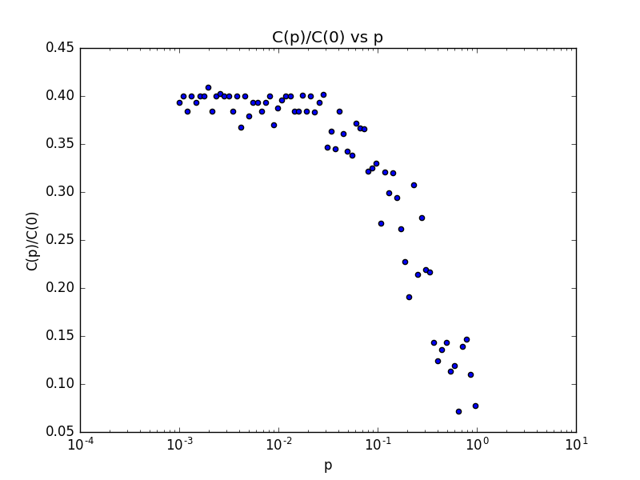
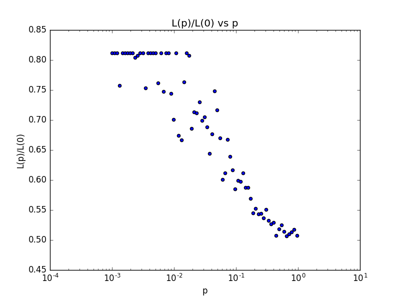
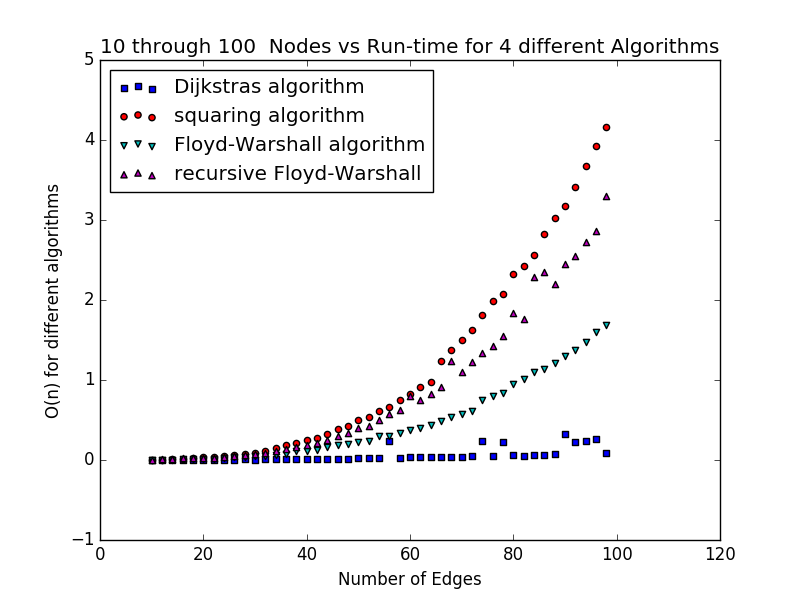
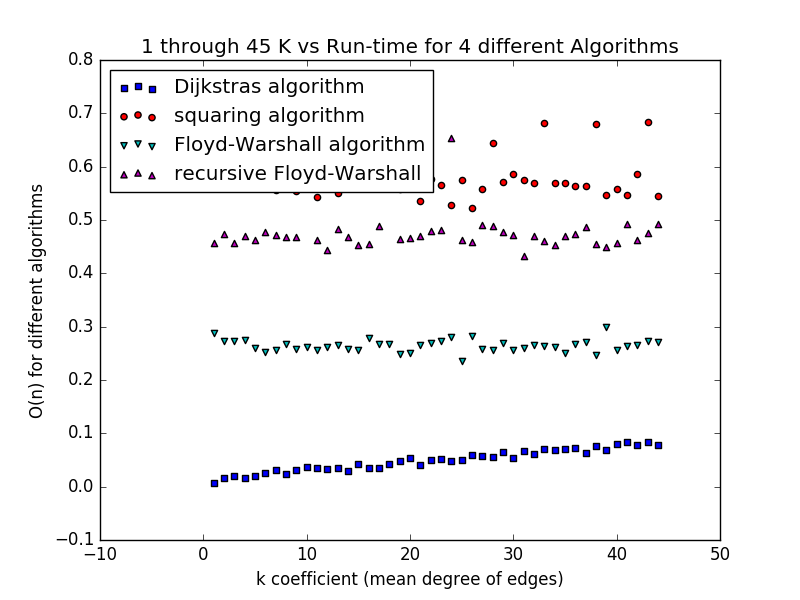

## Exercise 1  
>Write an implementation of a FIFO using either a doubly-linked list or a circular buffer.
>Yet another possibility is to use a Python dictionary and two indices: nextin keeps track of the back of the queue; nextout keeps track of the front. The dictionary maps from integer indices to values.
>Here is an implementation based on Raymond Hettinger’s recipe at http://code.activestate.com/recipes/68436/.
> ```python
>class DictFifo(object):
>
>    def __init__(self):
>        self.nextin = 0
>        self.nextout = 0
>        self.data = {}
>
>    def append(self, value):
>        self.data[self.nextin] = value
>        self.nextin += 1
>
>    def pop(self, n=-1):
>        value = self.data.pop(self.nextout)
>        self.nextout += 1
>        return value 
> ```
>append stores the new item and increments nextin; both operations are constant time.
>pop removes the last item and increments nextout. Again, both operations are constant time.
>
>As yet another alternative, the Python collections module provides an object called a deque, which stands for “double-ended queue”. It is supposed >to be pronounced “deck,” but many people say “deek.” A Python deque can be adapted to implement a FIFO.
>
>You can read about deques at http://en.wikipedia.org/wiki/Deque and get the details of the Python implementation at docs.python.org/lib/deque-objects.html.

## Exercise 2  
>The following implementation of a BFS contains two performance errors. What are they? What is the actual order of growth for this algorithm?
>def bfs(top_node, visit):
>    ```python 
>    """Breadth-first search on a graph, starting at top_node."""
>    visited = set()
>    queue = [top_node]
>    while len(queue):
>        curr_node = queue.pop(0)    # Dequeue
>        visit(curr_node)            # Visit the node
>        visited.add(curr_node)
>
>        # Enqueue non-visited and non-enqueued children
>        queue.extend(c for c in curr_node.children
>                     if c not in visited and c not in queue)
> ```
>Test this code with a range of graph sizes and check your analysis. Then use a FIFO implementation to fix the errors and confirm that your algorithm is linear.

## Excercise 3
Read [1998 Duncan Watts and Steven Strogatz published a paper in Nature, “Collective dynamics of ’small-world’ networks” ](http://www.nature.com/nature/journal/v393/n6684/abs/393440a0.html) and answer:   
(also [linked from Strogatz's site](https://static.squarespace.com/static/5436e695e4b07f1e91b30155/t/54452561e4b08d9eb2170909/1413817697054/collective-dynamics-of-small-world-networks.pdf) and on [wikipedia](https://en.wikipedia.org/wiki/Watts_and_Strogatz_model))

> 1. What process do Watts and Strogatz use to rewire their graphs?  

For every node n<sub>i</sub> in N select edge(n<sub>i</sub>, n<sub>i+1</sub>) and rewire it with probabilty B as edge(n<sub>i</sub>, n<sub>k</sub>) where k is chosen at random and k != i

2. What is the definition of the clustering coefficient C(p)?  
C(p) measures the cliquishness of a typical neighbourhood (a local property).

3. What is the definition of the average path length L(p)?  
Average distance to get from one node to any other.  

4. What real-world graphs did Watts and Strogatz look at? What evidence do they present that these graphs have the same structure as the graphs  generated by their model?  
Film Actors, Power Grids, and the neural network in C. elegans


## Exercise 4  
>Create a file named SmallWorldGraph.py and define a class named SmallWorldGraph that inherits from RandomGraph.
>If you did Exercise 2.4 you can use your own RandomGraph.py; otherwise you can download mine from thinkcomplex.com/RandomGraph.py.
>
>Write a method called rewire that takes a probability p as a parameter and, starting with a regular graph, rewires the graph using Watts and Strogatz’s algorithm.
>Write a method called clustering_coefficient that computes and returns the clustering coefficient as defined in the paper.
>Make a graph that replicates the line marked C(p)/C(0) in Figure 2 of the paper. In other words, confirm that the clustering coefficient drops off slowly for small values of p.

See [SmallWorldGraph.py](./code/SmallWorldGraph.py) for 1 and 2 (his code)  
See [SmallWorldGraphClustering.py](./code/SmallWorldGraphClustering.py) for 3  



## Excercise 4-5
See [SmallWorldPathLengths.py](./code/SmallWorldPathLengths.py)

>Write an implementation of Dijkstra’s algorithm and use it to compute the average path length of a SmallWorldGraph.
>Make a graph that replicates the line marked L(p)/L(0) in Figure 2 of the Watts and Strogatz paper. Confirm that the average path length drops off quickly for small values of p. What is the range of values for p that yield graphs with high clustering and low path lengths?  



High C(p)/C(0) and low L(p)/L(0) around 0.1  

## Exercise 6  
>A natural question about the Watts and Strogatz paper is whether the small world phenomenon is specific to their generative model or whether other similar models yield the same qualitative result (high clustering and low path lengths).
>To answer this question, choose a variation of the Watts and Strogatz model and replicate their Figure 2. There are two kinds of variation you might consider:

>Instead of starting with a regular graph, start with another graph with high clustering. One option is a locally-connected graph where vertices are placed at random locations in the plane and each vertex is connected to its nearest k neighbors.
>Experiment with different kinds of rewiring.
>If a range of similar models yield similar behavior, we say that the results of the paper are robust.

running See [SmallWorldGraph.py](./code/SmallWorldGraph.py) yielded;   
char_length =  3.2556561086  
char_length2 =  3.2556561086  
char_length3 =  3.2556561086  
char_length4 =  3.2556561086  
for the different algorithms included 


## Exercise 7  
>To compute the average path length in a SmallWorldGraph, you probably ran Dijkstra’s single-source shortest path algorithm for each node in the graph. In effect, you solved the “all-pairs shortest path” problem, which finds the shortest path between all pairs of nodes.
>Find an algorithm for the all-pairs shortest path problem and implement it. Compare the run time with your “all-source Dijkstra” algorithm.
>Which algorithm gives better order-of-growth run time as a function of the number of vertices and edges? Why do you think Dijkstra’s algorithm does better than the order-of-growth analysis suggests?   

Holy :hankey: Dijkstra. Wow



