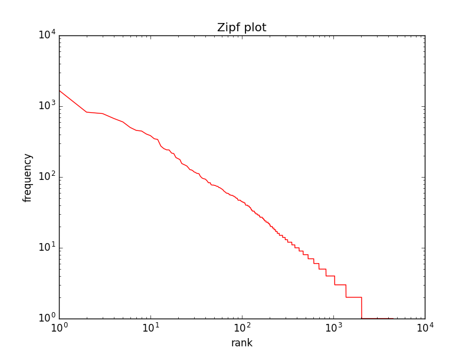
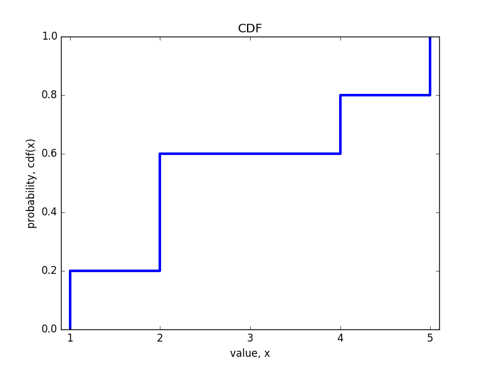

# Chapter 5 Scale-free networks 
[http://greenteapress.com/complexity/html/thinkcomplexity006.html](http://greenteapress.com/complexity/html/thinkcomplexity006.html)

## Exercise 1  
>Write a program that reads a text from a file, counts word frequencies, and prints one line for each word, in descending order of frequency. You can test it by downloading an out-of-copyright book in plain text format from gutenberg.net. You might want to remove punctuation from the words.
>If you need some help getting started, you can download [thinkcomplex.com/Pmf.py](thinkcomplex.com/Pmf.py), which provides an object named Hist that maps from value to frequencies.
>
>Plot the results and check whether they form a straight line. For plotting suggestions, see Section 3.6. Can you estimate the value of s?
>
>You can download my solution from thinkcomplex.com/Zipf.py  

See his [Zipf.py](./code/Zipf.py), the gatsby.txt was downloaded from [http://www.gutenberg.org/files/11/11-0.txt](http://www.gutenberg.org/files/11/11-0.txt)  

## Exercise 2  
>Read the code in Cdf.py. What is the order of growth for MakeCdfFromList and the methods Prob and Value?  

If you read them, they use a bisection search which is *O*(log*n*)  
  

## Exercise 3  
>Write a function called plot_ccdf that takes a list of values and the corresponding list of probabilities and plots the CCDF on a log-y scale.
>To test your function, use expovariate from the random module to generate 100 values from an exponential distribution. Plot the CCDF on a log-y scale and see if it falls on a straight line.  

## Exercise 4  
>Write a version of plot_ccdf that plots the complementary CCDF on a log-log scale.
>To test your function, use paretovariate from the random module to generate 100 values from a Pareto distribution. Plot the CCDF on a log-y scale and see if it falls on a straight line. What happens to the curve as you increase the number of values?

## Exercise 5  
>The distribution of populations for cities and towns has been proposed as an example of a real-world phenomenon that can be described with a Pareto distribution.
>The U.S. Census Bureau publishes data on the population of every incorporated city and town in the United States. I wrote a small program that downloads this data and converts it into a convenient form. You can download it from thinkcomplex.com/populations.py.
>
>Read over the program to make sure you know what it does and then write a program that computes and plots the distribution of populations for the 14593 cities and towns in the dataset.
>
>Plot the CDF on linear and log-x scales so you can get a sense of the shape of the distribution. Then plot the CCDF on a log-log scale to see if it has the characteristic shape of a Pareto distribution.
>
>What conclusion do you draw about the distribution of sizes for cities and towns?

## Exercise 6  
>This exercise asks you to make connections between the Watts-Strogatz (WS) and Barabási-Albert (BA) models:
>Read Barabási and Albert’s paper and implement their algorithm for generating graphs. See if you can replicate their Figure 2(A), which shows P(k) versus k for a graph with 150 000 vertices.
>Use the WS model to generate the largest graph you can in a reasonable amount of time. Plot P(k) versus k and see if you can characterize the tail behavior.
>Use the BA model to generate a graph with about 1000 vertices and compute the characteristic length and clustering coefficient as defined in the Watts and Strogatz paper. Do scale-free networks have the characteristics of a small-world graph?

## Exercise 7  
>The Stanford Large Network Dataset Collection is a repository of datasets from a variety of networks, including social networks, communication and collaboration, Internet and road networks. See http://snap.stanford.edu/data/index.html.
>Download one of these datasets and explore. Is there evidence of small-world behavior? Is the network scale-free? What else can you discover?

## Exercise 8  
>Are these explanations compatible; that is, can they both be right? Which do you find more satisfying as an explanation, and why?
>Is there data you could collect, or experiments you could perform, that would provide evidence in favor of one model over the other?
>
>Choosing among competing models is the topic of Thomas Kuhn’s essay, “Objectivity, Value Judgment, and Theory Choice.” Kuhn was a historian of science who wrote The Structure of Scientific Revolutions in 1962, and spent the rest of his life explaining what he meant to say.
>
>What criteria does Kuhn propose for choosing among competing models? Do these criteria influence your opinion about the WS and BA models? Are there other criteria you think should be considered?

